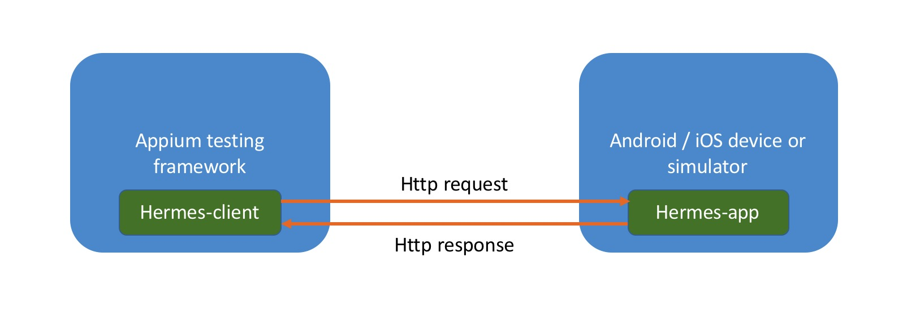
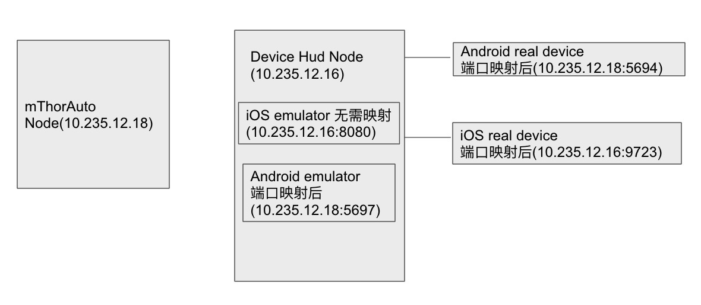

# Appium-hermes

> This project goal to create a app which can access android/ios native method and can be manipulated by your appium testing framework.

# Overview



> **Hermes-client** is a java project, use to send http request to **Hermes-app**
> 
> **Hermes-app** is a app install in android/ios device or simulator, it's a http server recevice http request from **Hermes-client**, and access native method according to request. This app build with cordova, you can refer https://cordova.apache.org/ for more information

# Current Support Native Method
✅ &nbsp; Native Contact Api

✅ &nbsp; InAppBrower Api

❎ &nbsp; Native Calendar Api

❎ &nbsp; Native Camera Api

❎ &nbsp; Native File Api

❎ &nbsp; Native Geolocation Api

❎ &nbsp; Others Native Api...

# Requirements
- **ios** `>= 9`
- **android** `>= 22`

# Usage
First, you should download **appium-hermes.apk**, **appium-hermes.ipa**, **appium-hermes.zip** from http://cloud-xmn.lab.nordigy.ru/apps/files/?dir=/mThor/apps/common&fileid=8093

And you can intergrate **Hermes-client** in your java appium testing framework project, like below:
```xml
<dependency>
     <groupId>com.ringcentral.hermes</groupId>
     <artifactId>Hermes-client</artifactId>
     <version>1.0.8</version>
</dependency>
```
```java
 AppiumDriver appiumDriver = createYourSelfAppiumDriver();
 String hermesAppPath = configHermesAppDownloadPath();
 HermesClientFactory hcf = new HermesClientFactory();
 hcf.setUp(appiumDriver, hermesAppPath);
 Thread.sleep(5000); // wait 5s to ensure Hermes-app is running
```

And use contact api like below:
```java
 ContactApiClient contactApiClient = hcf.getContactApiClient();
 
 //find contacts
 ResponseBean<List<ContactRsp>> responseBean = contactApiClient.findContact();
 
 //delete contact
 String id = responseBean.getContent().get(0).getId();
 contactApiClient.deleteContact(id);
 
 //add contact
 List<ContactReq.Email> emailList = new ArrayList<>();
 List<ContactReq.PhoneNumber> phoneNumberList = new ArrayList<>();
 ContactReq.Email email = new ContactReq.Email();
 email.setType("work");
 email.setValue("ABCabc@gmail.com");
 emailList.add(email);
 ContactReq.PhoneNumber phoneNumber = new ContactReq.PhoneNumber();
 phoneNumber.setType("work");
 phoneNumber.setValue("123456");
 phoneNumberList.add(phoneNumber);
 ContactReq contactReq = new ContactReq();
 contactReq.setFirstName("Jeffries");
 contactReq.setFamilyName("Yu");
 contactReq.setEmails(emailList);
 InputStream inputStream = this.getClass().getResourceAsStream("/Avatar.jpg");
 String avatarBase64 = Base64.getEncoder().encodeToString(IOUtils.toByteArray(inputStream));
 contactReq.setAvatar(avatarBase64); 
 contactReq.setPhoneNumbers(phoneNumberList);
 contactApiClient.addContact(contactReq);
```

# About Port-Mapping


# Develop

#### how to generate / develop HermesApp

step 1:
```bash
npm install -g cordova
cd HermesApp
brew install gradle
sudo gem install cocoapods
cd ~/Library/Android/sdk/tools/bin && .sdkmanager "build-tools;29.0.3"
cordova platform add ios
cordova platform add android
cordova requirements 
# should install lack requirements
# if requirements result is failed, resolve it and 
# delete platform dir and
# exec 'cordova platform add ios' && 'cordova platform add android' again
cordova build android
cordova build --emulator ios
cordova build --device ios
```

step 2:

```
Then install app on your device, open it.
it will start at port 8080.
use http util to request it.
The api write in ./HermesApp/www/js/contactApi/contactApi.js
```

# License

See [LICENSE](LICENSE).
